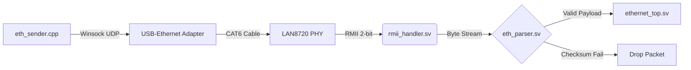

<div align="center">

# FPGA Ethernet


**A custom Ethernet networking stack using FPGA-based packet parsing in SystemVerilog, driven by a C++ packet transmitter.**

</div>

## Overview

This project implements a lightweight, hardware-accelerated Ethernet stack on the Intel Cyclone IV FPGA. Unlike standard microcontroller-based networking which relies on software interrupts, this design parses Ethernet II, IPv4, and UDP headers in real-time using dedicated digital logic.

The system features a custom C++ network driver that constructs and transmits raw UDP datagrams via Windows Sockets (Winsock). The FPGA receives these frames via a LAN8720 PHY using a Reduced Media Independent Interface (RMII), validates the IP header checksums in hardware, and triggers logic events based on the payload.

## System Architecture

The design is split into a software transmitter (PC) and a hardware receiver (FPGA). The PC handles the generation of the physical layer signals via a USB-Ethernet adapter, while the FPGA handles the high-speed decoding of the bitstream.



## Features

* Uses a finite state machine to parse Ethernet, IPv4, and UDP headers in hardware.
* Performs real-time 16-bit 1's complement checksum verification on the IPv4 header, dropping corrupted packets instantly.
* Uses the Winsock 2 API to send raw UDP datagrams to specific physical addresses.
* Uses Windows `netsh` configuration to enable point-to-point communication without needing an ARP replier on the FPGA.

## Hardware Implementation

The project runs on the Intel Cyclone IV EP4CE6E22C8N FPGA using the RZ-EasyFPGA A2.2 development board. The physical layer interface is provided by a generic LAN8720 Module. A USB-C to Ethernet adapter is used to create a dedicated local network link between the host PC and the FPGA.

* FPGA: [Intel Cyclone IV EP4CE6E22C8N](https://www.intel.com/content/www/us/en/products/sku/210472/cyclone-iv-ep4ce6-fpga/specifications.html)
* FPGA Development Board: [RZ-EasyFPGA A2.2 / RZ-EP4CE6-WX board](https://web.archive.org/web/20210128152708/http://rzrd.net/product/?79_502.html)
* Ethernet PHY: [LAN8720 PHY Module](https://www.ebay.com.au/itm/233326770234)
* Ethernet Adaptor: [ALOGIC Ultra Mini USB-C to Ethernet Adapter](https://www.jbhifi.com.au/products/alogic-ultra-mini-usb-c-to-ethernet-adapter)

### Pinout Configuration (LAN8720 to FPGA)

| Signal Name | FPGA Pin | LAN8720 Pin | Description |
| :--- | :--- | :--- | :--- |
| `clk` | **PIN_80** | **nINT/REFCLK** | 50MHz Reference Clock |
| `rx0` | **PIN_76** | **RX0** | RMII Data Bit 0 |
| `rx1` | **PIN_77** | **RX1** | RMII Data Bit 1 |
| `data_valid` | **PIN_83** | **CRS** | Carrier Sense / Data Valid |
| `resetn` | **PIN_25** | - | System Reset (Active Low) |

## Software Implementation

The software transmitter is written in C++ and compiled using MinGW/MSYS2. It uses the Windows Sockets 2 API to construct UDP datagrams.

Because the FPGA implementation is listen-only, and does not implement an ARP replier, the host PC must be manually configured to associate the FPGA's IP address with its MAC address using a static ARP entry.

**Setup Command (Admin Terminal):**
```cmd
netsh interface ip add neighbors "Ethernet Interface Name" 192.0.2.146 00-1A-2B-3C-4D-5E
```

## Directory Structure

```text
├── quartus/               # Quartus Prime project files and constraints
├── rtl/
│   ├── eth_parser.sv      # Main UDP/IPv4 State Machine
│   ├── rmii_handler.sv    # Physical Layer 2-bit Reassembler
│   ├── eth_types_pkg.sv   # Struct and Enum Definitions
│   └── ethernet_top.sv    # Top Level Module
└── software/
    └── eth_sender.cpp     # C++ UDP Datagram Transmitter
```
